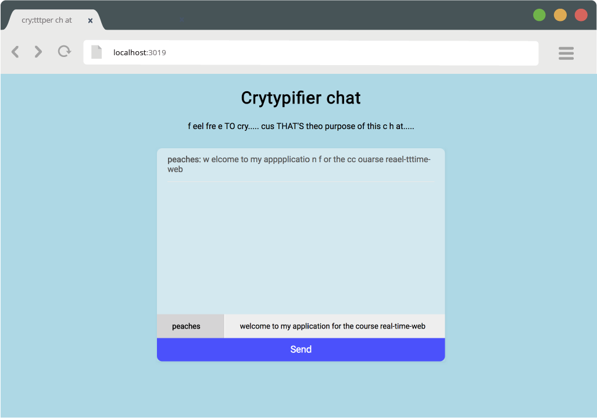
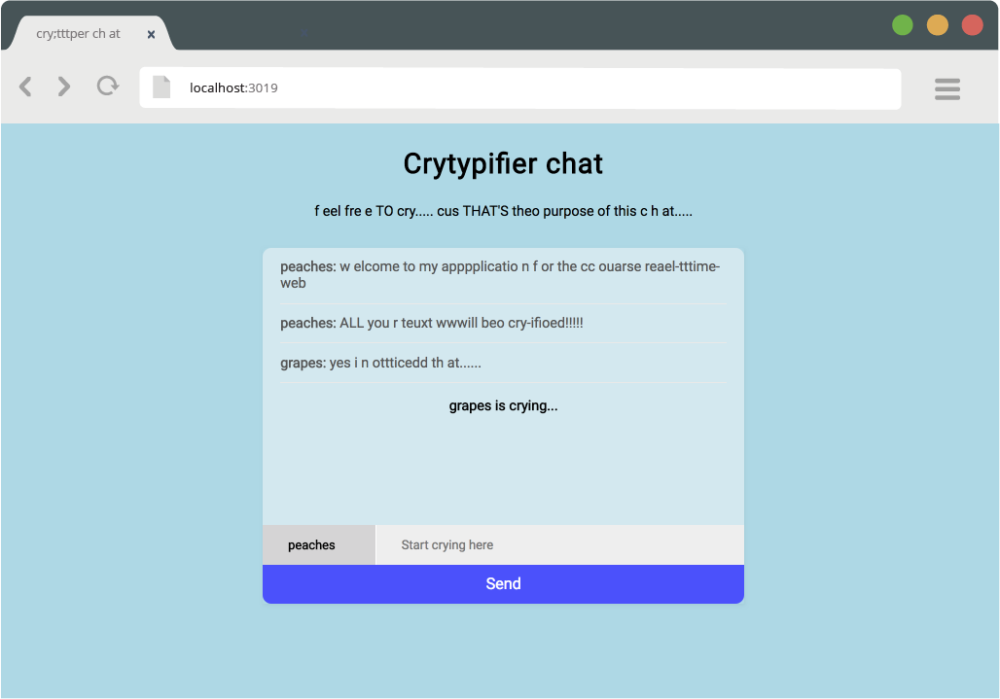

# Real-time Crytypifier chat
 _**Chat as if you can't stop crying while typing!**_

Made with socket.io, this app is a real-live chat where "normal" text input gets (a little) distorted as if you had been crying while typing.

## What can you do?
- Chat with other people real-time;
  * Fill in a user name and message
- See if somebody else is typing;
- Read your cry-fied text;
- Cry with others about how that one time five years ago someone bumped into you and you spilled your hot white chocolate mocha on your new white vans and they didn't even say sorry. :pensive:

## Tooling
- [x] Express server
- [x] ESJ templates
- [x] Socket.io for real-time functionalities
- [x] Javascript for chat- and crytyper functions

## Set up
### Prerequisites

Make sure you have nodemon installed globally by running `nodemon -v` in your terminal. If you get any errors, run `npm install -g nodemon` instead.

### Installing the project
- First, download or clone the project;
- Install the dependencies with `npm i` in your terminal in the root folder;
- When that's done, run `nodemon app.js` to start the server on port 3019.

## Process

I started with creating the needed files for the project (the folders, app.js, index.ejs, etc) and installed the needed modules for the chat. After that I created the chat.js files and found the crytyper.js somewhere (and refactored it a little) and hoped everything would work. And it thankfully did.

> If you're seeing this message on a forked repo, it means this student did change the description!
